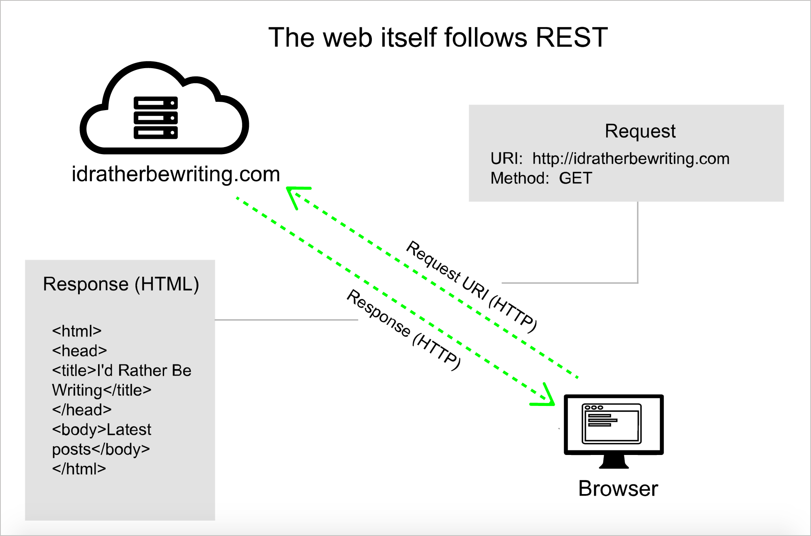
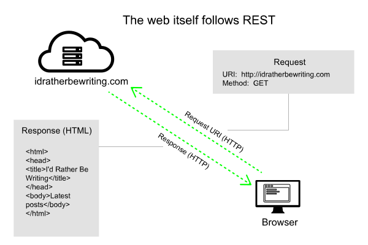

In this book on writing documentation for REST APIs, instead of just talking about abstract concepts, I contextualize REST APIs with a direct, hands-on approach.

You'll learn about API documentation in the context of using some simple weather APIs to put a weather forecast on your site.

As you use the API, you'll learn about endpoints, parameters, data types, authentication, cURL, JSON, the command line, Chrome's Developer Console, JavaScript, and other details associated with REST APIs.

The idea is that rather than learning about these concepts independent of any context, you learn them by immersing yourself in a real scenario while using an API. This makes these tools more meaningful.

<figure>



<figcaption>REST APIs involve requests and responses over HTTP protocol</figcaption></figure>

After you use the API as a developer, you'll then shift perspectives and "become a technical writer" tasked with documenting a new endpoint that has been added to an API.

As a technical writer, you'll tackle each element of a reference topic in REST API documentation:

* Resource descriptions
* Endpoint definitions and methods
* Parameters
* Sample requests
* Sample responses
* Error codes
* Code samples

Diving into these sections will give you a solid understanding of how to document REST APIs.

Finally, you'll dive into different ways to publish REST API documentation, exploring tools and specifications such as API Blueprint, Swagger, RAML, readme.io, Jekyll, and more.

You'll learn how to leverage templates, build interactive API consoles so users can try out requests and see responses, and learn different ways to host and publish your documentation.

## Book organization

Organizationally, this book is divided into the following sections:

*  **Introduction to REST APIs**
*  **Using a REST API like a developer**
*  **Documenting endpoints**
*  **Documenting non-reference content**
*  **Exploring other REST APIs**
*  **Publishing API documentation**
*  **Design patterns**
*  **Documenting native library APIs**

You don't have to read the chapters in order &mdash; skip around as you prefer. But some of the earlier sections on using a REST API like a developer and documenting endpoints follow a somewhat sequential order with the same weather API scenario.

Because the purpose of the book is to help you learn, there are many activities that require hands-on coding and other exercises. Along with the learning activities, there are also conceptual deep dives, but the focus is always on *learning by doing*.

## No programming skills required

As for the needed technical background for the course, you don't need any programming background or other prerequisites, but it will help to know some basic HTML, CSS, and JavaScript.

If you do have some familiarity with programming concepts, you might speed through some of the sections and jump ahead to the topics you want to learn more about. This book assumes you're a beginner, though.

Note that some of the code samples in this course use JavaScript. JavaScript may or may not be a language that you actually use when you document REST APIs, but most likely there will be some programming language or platform that becomes important to know.

JavaScript is one of the most useful and easy languages to become familiar with, so it works well in code samples for this introduction to REST API documentation. JavaScript allows you to test out code by merely opening it in your browser (rather than compiling it in an IDE).

## What you'll need

Here are a few things you'll need in this course:

* **Text editor**. ([Sublime Text](http://www.sublimetext.com/) is a good option (it works on both Mac and Windows), but any text editor will do. On Windows, [Notepad++](https://notepad-plus-plus.org/) and [Komodo Edit](http://komodoide.com/komodo-edit/) are also good.)
* **[Chrome browser](http://www.google.com/chrome/)**. (Other browsers are fine too, but we'll be using Chrome's Developer Console.)
* **[Postman - REST Client (Chrome or Mac app)](http://www.getpostman.com/)**. Postman is an app that allows you to make requests and see responses through a GUI client. You can either use the Chrome or Mac app.
* **[cURL](http://curl.haxx.se/)**. cURL is essential for making requests to endpoints from the command line. Mac computers already have cURL installed. Windows users should follow the instructions for installing cURL [here](http://www.confusedbycode.com/curl/#downloads).
* **[Git](https://git-scm.com/)**. Git is a version control tool developers often use to collaborate on code. See [Set Up Git](https://help.github.com/articles/set-up-git/) for more details.


## Short version of the course in video

If you'd prefer a short version of the course in video form, see this workshop I gave to the STC Sacramento chapter:

<iframe width="640" height="360" src="https://www.youtube.com/embed/GerbihyUpdo" frameborder="0" allowfullscreen></iframe>


## Stay updated

If you're taking this course, you most likely want to learn more about APIs. I publish regular articles that talk about APIs and strategies for documenting them. You can stay updated about these posts by subscribing to my free newsletter at [https://tinyletter.com/tomjohnson1492](https://tinyletter.com/tomjohnson1492).
